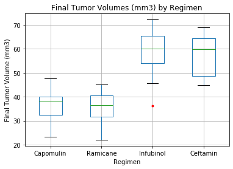

# University of Denver Data Analytics Boot Camp: Matplotlib  - The Power of Plots 

This assignment consists of using Matplotlib and Python Pandas to analyze data from a pharmaceutical study on tumor growth in mice. The data consists of 249 mice, various drug regimens used and the change in tumor size for each mouse.
## Instructions

Your tasks are to do the following:

* Before beginning the analysis, check the data for any mouse ID with duplicate time points and remove any data associated with that mouse ID. **There was one mouse with duplicated timepoints that needed to be dropped:**

* Generate a summary statistics table consisting of the mean, median, variance, standard deviation, and SEM of the tumor volume for each drug regimen.

* Generate a bar plot that shows the total number of measurements taken for each treatment regimen throughout the course of the study.

* Generate a pie plot using that shows the distribution of female or male mice in the study.
  

* Calculate the final tumor volume of each mouse across four of the most promising treatment regimens: Capomulin, Ramicane, Infubinol, and Ceftamin. Calculate the quartiles and IQR and quantitatively determine if there are any potential outliers across all four treatment regimens.

* Using Matplotlib, generate a box and whisker plot of the final tumor volume for all four treatment regimens and highlight any potential outliers in the plot by changing their color and style.

* Select a mouse that was treated with Capomulin and generate a line plot of tumor volume vs. time point for that mouse.

* Generate a scatter plot of mouse weight versus average tumor volume for the Capomulin treatment regimen.

* Calculate the correlation coefficient and linear regression model between mouse weight and average tumor volume for the Capomulin treatment. Plot the linear regression model on top of the previous scatter plot.

# Observations and Insights

 * There is only one potential outlier for final tumor volume. This can be seen in the box plot for the Infubinol regimen. 
 * For mouse ID s185 the tumor volume appears to decrease over time with the Capomulin regimen. This is shown on the line plot.
 * Average tumor volume appears to increase with the weight of the mouse as shown in the scatter plot.

